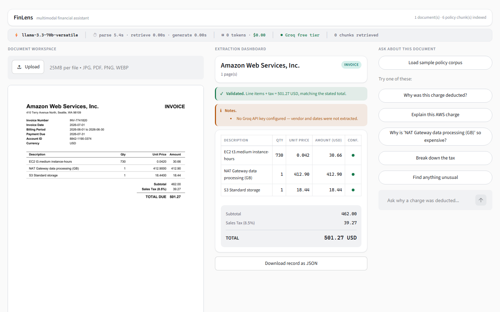
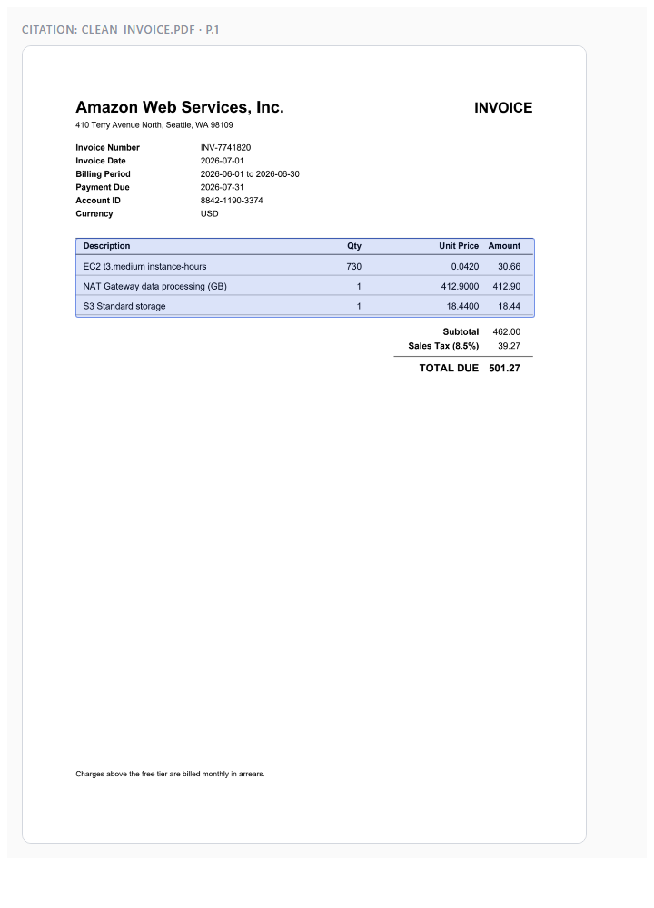

# FinLens — Multimodal AI Financial Assistant

Upload a financial document — an invoice, a card statement, a photographed receipt — and ask
*"why was this charge deducted?"*. FinLens extracts the structured record, retrieves the policy
that explains the charge, and answers with every figure traceable to a source.

**It runs at $0.** Documents are parsed locally, embedded locally, and stored locally. The only
cloud calls are one or two per question, against a free tier that needs no credit card.



---

## What it actually does

Ask *"Why is the NAT Gateway charge so high? Check it against our cloud billing policy."* and it
answers (verbatim, abridged at the ellipsis):

> The NAT Gateway charge is high because it is billed per GB of data processed, and the invoice
> shows a charge of "412.90" USD `[clean_invoice.pdf:1]` for "1" GB `[clean_invoice.pdf:1]`.
> According to the cloud billing policy, NAT Gateways are billed on two separate dimensions: an
> hourly charge for each gateway and a data processing charge per GB passed through it
> `[cloud_billing_policy.md:1]`. […] The charge of "412.90" USD exceeds the internal budget alert
> threshold of USD 200 per month `[cloud_billing_policy.md:1]`, indicating that this spend should
> be reviewed by the infrastructure lead.

Two documents, three citations, and every number checked against the extracted record before it
reaches the screen.

Ask it something the documents do not answer and it refuses:

> I cannot determine this from the provided documents. The documents provided are related to an
> invoice from Amazon Web Services and corporate travel and cloud billing policies, and do not
> mention the CEO's salary. To answer this question, a document containing information about the
> CEO's salary, such as a company's annual report or financial statements, would be needed.

---

## The zero-cost stack

| Layer | Technology | Cost | Runs |
|---|---|---|---|
| Orchestration | Python 3.12 + LangChain (LCEL) | Free (OSS) | Local |
| Document parsing | Docling — layout + TableFormer | Free (OSS) | Local, CPU |
| OCR fallback | RapidOCR via onnxruntime | Free (OSS) | Local, CPU |
| Vector store | ChromaDB, embedded persistent client | Free (OSS) | Local, on disk |
| Embeddings | `all-MiniLM-L6-v2`, 384-dim | Free (OSS) | Local, CPU |
| Reasoning | Groq — `llama-3.3-70b-versatile` | Free tier | Cloud |
| Query rewriting / eval judge | Groq — `llama-3.1-8b-instant` | Free tier | Cloud |
| Evaluation | Ragas | Free (OSS) | Local + Groq |
| Frontend | Streamlit + custom CSS | Free (OSS) | Local |

No component requires a credit card. See `rules.md` Rule 1 for what that constraint forbids and
why it is a design forcing function rather than a budget.

---

## Setup

**Requirements:** Python 3.10+ (developed on 3.12.10), ~4 GB disk for models, CPU only.

```bash
python -m venv venv
venv\Scripts\activate            # Windows;  source venv/bin/activate elsewhere

# CPU-only torch first — saves ~2 GB of CUDA wheels you will not use.
pip install torch --index-url https://download.pytorch.org/whl/cpu
pip install -r requirements.txt
```

**Get a free Groq key** at [console.groq.com/keys](https://console.groq.com/keys) — no credit card.

```bash
cp .env.example .env
# then edit .env and replace gsk_your_key_here with your key
```

**Verify the environment.** This checks every dependency, embeds a string locally, opens Chroma,
and pings Groq:

```bash
python scripts/verify_setup.py     # must exit 0
python scripts/check_models.py     # confirms the configured models are still served
```

`check_models.py` matters more than it looks — Groq retires models on short notice, and this
project has already been broken twice by it (see `memory.md`, decisions D-3 and D-15).

**Generate the sample documents.** No real financial documents are in this repository; every
fixture is generated from invented data:

```bash
python scripts/make_fixtures.py
```

---

## Running

```bash
streamlit run app.py
```

First launch downloads ~500 MB of Docling layout models and takes about 20 seconds. After that it
is cached and fully offline. The app then opens on the Document Workspace — drop a PDF or image,
or click one of the four sample documents.

**Evaluation:**

```bash
python -m src.evals --extraction    # deterministic only — zero API calls, run freely
python -m src.evals --pace 3        # full suite including Ragas metrics
python -m src.evals --limit 8       # quick spot check
```

**Tests:**

```bash
pytest                    # 198 offline tests, no API calls, free
pytest -m integration     # 8 live-API tests
mypy src app.py ui        # clean across 14 modules
```

---

## How it works

```
upload ─→ parser.py ─→ extractor.py ─→ vectorstore.py ─→ chain.py ─→ app.py
          Docling      FinancialRecord   Chroma+MiniLM    Groq RAG    Streamlit
             │
             └─→ RapidOCR (only when a page has no text layer)
```

Three design decisions shape everything else:

**Numbers are deterministic, prose is not.** Line items come from Docling's table structure and
totals from labelled-amount regexes. The model supplies vendor names and dates — things that vary
too much for patterns. Where the model *does* propose an amount, it is accepted only if that exact
figure appears in the document text. The model can read; it cannot invent.

**One chunk per table row, never split.** A row split across chunks retrieves a description
attached to the wrong amount, which is the dominant cause of hallucinated invoice figures.

**Grounding is checked, not requested.** The prompt asks for citations and refusals, and then the
chain verifies: citation markers are resolved against chunks actually retrieved (invented ones are
reported), and every monetary figure is traced to the record or to a retrieved snippet.

Bounding boxes from Docling are normalized to top-left 0–1 coordinates, so clicking a citation
highlights the source region on the page image:



---

## Project layout

```
prd.md architecture.md rules.md phases.md design.md memory.md   ← read these first
app.py                    Streamlit dashboard
ui/styles.py              design tokens, one place, no hardcoded hex
ui/components.py          render helpers for the four surfaces
src/config.py             model IDs, paths, thresholds — model strings live ONLY here
src/llm.py                ChatGroq factory, provider-error translation, retries
src/schemas.py            FinancialRecord, Citation, Answer, RunStats — all money is Decimal
src/parser.py             Docling ingestion, OCR fallback, bbox normalization
src/extractor.py          ParsedDocument → validated FinancialRecord
src/vectorstore.py        chunking, local embedding, filtered retrieval
src/chain.py              LCEL RAG chain, streaming, citation + numeric verification
src/observability.py      per-request telemetry for the Observability Bar
src/evals.py              Ragas + deterministic extraction accuracy + grounding checks
scripts/                  setup verification, model liveness, fixture generation
evals/                    golden set (28 items), expectations, synthetic fixtures
```

The six markdown files at the root are the project's memory. `memory.md` in particular holds a
32-entry decision log explaining *why* things are the way they are — including several decisions
that were reversed when reality disagreed with the plan.

---

## What is verified, and what is not

Being straight about this matters more than a green badge.

**Verified:**

| | |
|---|---|
| `total_amount` extraction accuracy | **100%** (5/5 fixtures) — target 95% |
| Line-item recall | **100%** (17/17) — target 90% |
| Field accuracy | **100%** (40/40) |
| Tests | 198 offline + 8 live-API, `mypy` clean |
| Arithmetic validation | The deliberately unbalanced fixture is flagged, and **neither figure is adjusted** |
| OCR fallback | Fires on the scanned receipt and on nothing else |
| Responsive | No horizontal body scroll at 1440 / 1024 / 768 / 390 px |
| Citation highlighting | Lands on the correct region of the correct page |
| Graceful degradation | With no API key, extraction still works and says what is missing |

**Not yet verified:**

- **Ragas metrics (faithfulness, answer relevancy, context precision/recall) have not been
  measured.** The judge configuration is confirmed working in isolation — faithfulness scores 1.0
  on a grounded answer and 0.0 on a hallucinated one — but a full run needs ~220k tokens against
  Groq's 100k/day cap. Run `python -m src.evals --pace 3` on a fresh daily budget.
- **Refusal correctness is an open question.** One of four refusal cases is confirmed correct; the
  other three could not be re-tested before the token cap hit. They may be genuine grounding
  failures or a gap in the refusal detector — do not assume which without reading the answers.
- The ask → answer leg has not been walked in a browser (it needs tokens).

## Known limitations

- **Free-tier token budget is the binding constraint.** 100,000 tokens/day on the reasoning model.
  A full evaluation run costs roughly twice that, so complete runs are possible about every other
  day. `--extraction` is free and unlimited.
- **Citation highlighting is table-granular.** Citing one row highlights the whole table, because
  row chunks inherit the table's bounding box.
- **Comma-decimal amounts are rejected, not parsed.** `1.234,56` returns `None` rather than risk a
  1000× error. Latin-script, period-decimal documents only.
- **No handwriting recognition**, no multi-user auth, no bank integrations. See `prd.md` §7.
- Streamlit columns stack below 1200px rather than becoming the tabbed layout `design.md` §4.2
  sketches.

## Privacy

Documents are parsed, embedded, and stored entirely on your machine. `data/` is gitignored in
full. Only the text of retrieved chunks and your question are sent to Groq, and only when you ask
one — page images never leave the machine. No real financial documents are in this repository, and
`rules.md` Rule 4 forbids adding any.

---

## License

Synthetic fixtures and project code are provided as-is for educational use. Third-party
dependencies retain their own licenses — Docling (MIT), ChromaDB (Apache-2.0),
sentence-transformers (Apache-2.0), Streamlit (Apache-2.0), PyMuPDF (AGPL).
