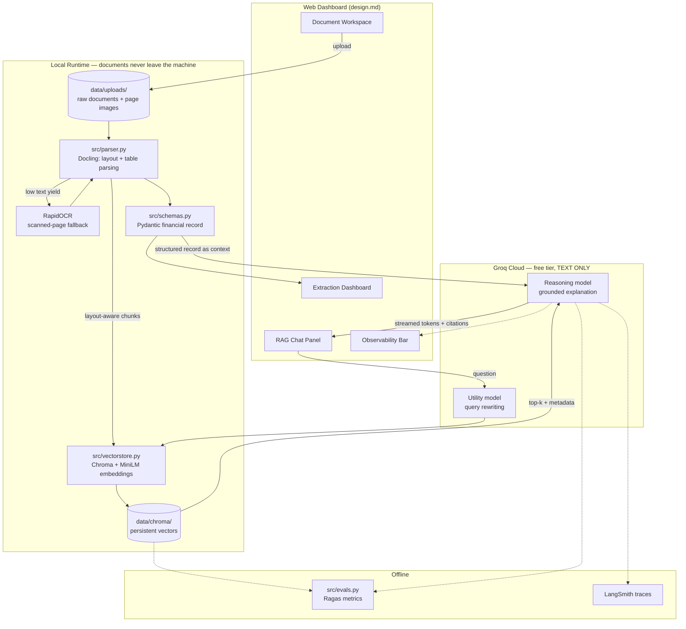

# Architecture — Multimodal AI Financial Assistant

**Status:** Draft v1.0
**Last updated:** 2026-07-25
**Governing constraint:** 100% zero-cost. Every component below is either local open-source or a
free-tier cloud API. See `rules.md` Rule 1.

---

## 1. The Stack At A Glance

| Layer | Technology | Cost | Runs |
|---|---|---|---|
| Orchestration | **Python 3.12 + LangChain** (LCEL) | Free (OSS) | Local |
| Document parsing | **Docling** (IBM, MIT) | Free (OSS) | Local, CPU |
| OCR (scanned pages) | **RapidOCR** via Docling, onnxruntime | Free (OSS) | Local, CPU |
| Vector store | **ChromaDB** (persistent client) | Free (OSS) | Local, on-disk |
| Embeddings | **HuggingFace `sentence-transformers/all-MiniLM-L6-v2`** | Free (OSS) | Local, CPU |
| Reasoning LLM | **Groq Cloud API** | Free tier | Cloud |
| Evaluation | **Ragas** | Free (OSS) | Local + Groq |
| Observability | **LangSmith** | Free tier (5k traces/mo) | Cloud |
| Frontend | **Streamlit** (custom CSS) or **React + FastAPI** | Free (OSS) | Local |

**Nothing in this stack requires a credit card.**

---

## 2. System Diagram



---

## 3. Component Specifications

### 3.1 Orchestration — Python + LangChain

- **Python 3.12** (confirmed installed: 3.12.10). Virtualenv at `venv/`.
- **LangChain Expression Language (LCEL)** for all chain composition. Chains are built as
  `prompt | llm | parser` pipelines so that `.stream()`, `.batch()`, and callback-based tracing
  come for free.
- **Why LangChain and not raw SDK calls:** we need retriever abstractions, streaming callbacks,
  structured output parsing, and LangSmith tracing to be uniform across the vision path, the
  reasoning path, and the eval harness. Hand-rolling all four is the actual cost.
- Packages: `langchain`, `langchain-core`, `langchain-community`, `langchain-groq`,
  `langchain-huggingface`, `langchain-chroma`.

### 3.2 Document Parsing — Docling

- **Docling** (`docling`, MIT license, IBM Research) converts PDF/image → a structured
  `DoclingDocument` with an explicit layout tree: headings, paragraphs, and — critically —
  **`TableItem` objects with row/column structure preserved**.
- **Why Docling over PyPDF2 / pdfplumber / unstructured:**
  - PyPDF2 returns raw text with no layout; invoice tables flatten into unusable strings.
  - pdfplumber has table extraction but is heuristic and brittle on ruled-less tables.
  - `unstructured`'s good models are gated behind a paid API tier — violates Rule 1.
  - Docling runs its layout model (DocLayNet) and TableFormer **fully locally on CPU**, exports
    to markdown/JSON/HTML, and handles scanned pages via built-in OCR (EasyOCR/Tesseract backend).
- **First-run cost:** Docling downloads ~500 MB of layout/table models to the HF cache. One time,
  free, then fully offline. This is documented as a Phase 1 setup step.
- **Output contract:** `parser.py` returns `ParsedDocument { markdown, tables: list[DataFrame],
  page_images: list[Path], page_count, text_yield_ratio }`.
- `text_yield_ratio` (extracted chars ÷ page area heuristic) is the trigger for the vision
  fallback: below threshold ⇒ the page is effectively an image ⇒ escalate to the vision model.

### 3.3 Vector Store — ChromaDB

- **`chromadb.PersistentClient(path="data/chroma")`** — embedded, no server process, no Docker,
  no cloud account. Data is a local SQLite + parquet directory.
- **Why Chroma over FAISS / Qdrant / Pinecone:**
  - Pinecone/Weaviate Cloud — free tiers exist but are account-gated and eventually meter. Rule 1
    says local-first.
  - FAISS — fast, but no metadata filtering out of the box; we *need* `where={"document_id": ...}`
    for FR-3.4.
  - Qdrant local requires Docker; Chroma is `pip install` and done.
- **Collections:**
  - `financial_documents` — chunks from user-uploaded documents.
  - `policy_corpus` — supporting context: prior statements, travel policies, vendor pricing terms.
- **Metadata schema per chunk:**
  ```python
  {
      "document_id": str,     # uuid4 of the upload
      "filename": str,
      "page": int,
      "chunk_type": Literal["text", "table_row", "table_summary"],
      "vendor": str | None,
      "billing_date": str | None,  # ISO-8601; Chroma metadata must be scalar
      "ingested_at": str,
  }
  ```
- **Chunking strategy:** layout-aware, not naive character splitting.
  - Narrative text → `RecursiveCharacterTextSplitter(chunk_size=800, chunk_overlap=120)`.
  - Tables → **one chunk per row**, serialized as `"Description: X | Qty: 2 | Unit: $30 | Amount:
    $60"`, plus one table-summary chunk carrying the header and totals. A table row is never
    split (FR-3.1) — splitting a row is what makes RAG hallucinate amounts.

### 3.4 Embeddings — HuggingFace `all-MiniLM-L6-v2`

- `langchain_huggingface.HuggingFaceEmbeddings` wrapping
  `sentence-transformers/all-MiniLM-L6-v2`.
- 384 dimensions, ~80 MB, runs on CPU in milliseconds per chunk.
- **Why this model:** it is the best-known quality-per-megabyte on CPU for short-passage
  retrieval, and it keeps embeddings entirely local — no per-token embedding API charges, and no
  financial data sent to an embedding provider.
- **Trade-off, stated honestly:** 256-token context window. Chunks longer than that get truncated
  at embed time. This is exactly why the chunk sizes in §3.3 are small. If retrieval quality on
  the golden set proves insufficient, the upgrade path is `BAAI/bge-small-en-v1.5` (same size
  class, 512 tokens) — still local, still free.
- Model cached at `~/.cache/huggingface/`; downloaded once.

### 3.5 LLMs — Groq Cloud API

`langchain_groq.ChatGroq`. Free tier, generous rate limits, and the fastest inference available
at $0. API key via `GROQ_API_KEY` in `.env` — **never committed**.

**Two roles, two models — both text-only:**

| Role | When used | Model ID (config-driven) | Verified served |
|---|---|---|---|
| **Reasoning** | All RAG question answering, explanation generation | `llama-3.3-70b-versatile` | 2026-07-25 ✅ |
| **Fast/utility** | Query rewriting, classification, eval judging | `llama-3.1-8b-instant` | 2026-07-25 ✅ |

> ⚠️ **There is no vision model in this architecture, and that is a finding, not an oversight.**
>
> The brief named *Llama 3.2 Vision*. Groq's `llama-3.2-*-vision-preview` endpoints were preview
> models that have been retired. We moved to **Llama 4 Scout**; `scripts/check_models.py` run
> against the live account then showed Groq serves **no image-input model at all** — not Scout,
> not Maverick, nothing. The 15 models Groq currently serves are text (`llama-3.3-70b-versatile`,
> `llama-3.1-8b-instant`, `openai/gpt-oss-*`, `qwen/qwen3.6-27b`, `allam-2-7b`), agentic
> (`groq/compound*`), safety classifiers (`llama-prompt-guard-2-*`), speech (`whisper-large-v3*`),
> and TTS (`canopylabs/orpheus-*`).
>
> **Resolution (decision D-15):** scanned pages are handled by **Docling's local RapidOCR engine**
> instead of a cloud VLM. Rejected alternatives: a second cloud provider (would require amending
> Rule 1 and would send page images off-machine) and a local VLM via Ollama (~30–90 s/page on CPU,
> breaking NFR-3, and tight on 8 GB RAM). Local OCR is free, deterministic, rate-limit-free, and
> keeps document images on the user's machine — it strengthens Rule 1 rather than bending it.
>
> **What this costs us, stated plainly:** OCR is weaker than a VLM on genuinely poor-quality
> photographs (skew, shadows, crumpling), and we lose the ability to answer semantic questions
> *about* an image ("is this receipt handwritten?"). Both are acceptable for v1. The signal that
> would force a revisit is in §8.
>
> **Mitigation that remains in force:** all model IDs live in `src/config.py` as named constants
> (`REASONING_MODEL`, `UTILITY_MODEL`). No model string is ever inlined into a chain, and
> `scripts/check_models.py` probes Groq's `/models` endpoint to confirm the configured IDs are
> still served. That script is what caught this.

**Rate-limit strategy (free tier is the binding constraint, not correctness):**
- Exponential backoff with jitter on HTTP 429.
- A local prompt-hash → response cache (`data/llm_cache.db`, SQLite) so that repeated eval runs
  and repeated demo questions cost zero additional requests.
- With OCR local, the *only* cloud calls in the whole system are reasoning and query rewriting —
  one or two per user question. Document parsing consumes no quota at all.

### 3.6 Evaluation — Ragas

- Metrics: `faithfulness`, `answer_relevancy`, `context_precision`, `context_recall`.
- Ragas needs a judge LLM and an embedding model. Both are pointed at our free stack: the judge
  is `llama-3.1-8b-instant` via `ChatGroq`, the embeddings are the same local MiniLM instance.
  This keeps evaluation at $0 — the usual Ragas setup defaults to a paid OpenAI judge.
- Extraction accuracy is evaluated separately with a plain deterministic comparator (per-field
  exact match, `Decimal`-aware amount comparison) — no LLM judge needed for structured fields, so
  no tokens spent.
- Golden set lives at `evals/golden_set.jsonl`, versioned in git; the source documents live in
  `evals/fixtures/` (synthetic invoices only — no real PII).

### 3.7 Observability — LangSmith

- `LANGCHAIN_TRACING_V2=true`, `LANGCHAIN_API_KEY`, `LANGCHAIN_PROJECT=multimodal-fin-assistant`.
- Free tier: 5,000 traces/month — ample for development.
- Traces every LCEL step: retrieval hits, prompt sent, tokens, latency per stage.
- **Graceful degradation is mandatory:** if `LANGCHAIN_API_KEY` is absent, the app runs normally
  with tracing disabled. Observability is never a hard dependency of the request path.
- The in-app Observability Bar (FR-5.4) reads from a local `RunStats` callback handler, so latency
  and token counts are visible in the UI **without** requiring a LangSmith account at all.

---

## 4. Module Layout

```
Multimodel_AI_Assistant/
├── prd.md  architecture.md  rules.md  phases.md  design.md  memory.md
├── requirements.txt
├── .env.example                 # committed;  .env is NOT
├── .gitignore
├── app.py                       # frontend entrypoint (Phase 5)
├── src/
│   ├── __init__.py
│   ├── config.py                # env loading, model IDs, paths, thresholds
│   ├── llm.py                   # ChatGroq factory + provider-error translation
│   ├── schemas.py               # Pydantic: FinancialRecord, LineItem, TaxLine, Citation
│   ├── parser.py                # Phase 2 — Docling ingestion + local OCR fallback
│   ├── extractor.py             # Phase 2 — parsed doc -> FinancialRecord + validation
│   ├── vectorstore.py           # Phase 3 — chunking, embedding, Chroma CRUD, retrieval
│   ├── chain.py                 # Phase 4 — LCEL RAG chain, streaming, citations
│   ├── observability.py         # RunStats callback: tokens, latency, model in use
│   └── evals.py                 # Phase 5 — Ragas + extraction accuracy harness
├── ui/                          # Phase 5 — components/CSS (Streamlit) or React app
├── data/                        # gitignored
│   ├── uploads/  chroma/  llm_cache.db
├── evals/
│   ├── golden_set.jsonl  fixtures/
├── scripts/
│   └── check_models.py          # Groq model liveness probe
└── tests/
```

**Dependency direction is strictly one-way** (Rule 2):

```
config  ←  llm  ←  schemas  ←  parser  ←  extractor  ←  vectorstore  ←  chain  ←  app.py
                                                                          ↖  evals
```

`llm.py` sits next to `config` because retry policy, timeouts, and rate-limit translation
must be defined once. `extractor`, `chain`, and `evals` all consume it; it consumes only
configuration.

`chain.py` never imports from `app.py`. The frontend is a consumer of `src/`, never a peer. This
is what makes the Streamlit-vs-React decision (design.md §2) reversible without touching business
logic.

---

## 5. Key Data Contracts

```python
# src/schemas.py  (Phase 2)

class LineItem(BaseModel):
    description: str
    quantity: Decimal | None = None
    unit_price: Decimal | None = None
    amount: Decimal
    category: str | None = None
    source_page: int
    confidence: float = Field(ge=0.0, le=1.0)

class TaxLine(BaseModel):
    label: str                      # "VAT", "GST", "Sales Tax"
    rate: Decimal | None = None     # 0.20 for 20%
    amount: Decimal

class FinancialRecord(BaseModel):
    document_id: str
    vendor_name: str
    document_type: Literal["invoice", "statement", "receipt", "expense_report"]
    invoice_number: str | None = None
    billing_date: date | None = None
    billing_period_start: date | None = None
    billing_period_end: date | None = None
    currency: str = "USD"
    line_items: list[LineItem]
    subtotal: Decimal | None = None
    tax_lines: list[TaxLine] = []
    total_amount: Decimal
    extraction_warnings: list[str] = []   # populated by arithmetic validation (FR-2.4)

class Citation(BaseModel):
    document_id: str
    filename: str
    page: int
    snippet: str
    score: float
```

**All monetary values are `Decimal`, never `float`.** Float arithmetic on currency produces
`0.30000000000000004`-class errors, and this application's entire credibility rests on its
numbers being exactly right.

---

## 6. Request Flow — "Why was this charge deducted?"

1. **UI** submits question + `active_document_id` + chat history.
2. **`chain.py`** rewrites the question into a retrieval query using the utility model
   (resolves "this charge" against conversation history).
3. **`vectorstore.py`** runs two retrievals:
   - scoped: `financial_documents` filtered to `document_id`, k=6
   - unscoped: `policy_corpus`, k=4
4. Retrieved chunks + the validated `FinancialRecord` (as compact JSON) are assembled into the
   prompt. The structured record is included so the model does not have to re-derive totals from
   prose — a major hallucination source.
5. **Groq reasoning model** streams the answer. System prompt hard-requires: cite sources by
   `[doc:page]`, and refuse to state any figure not present in context (FR-4.2).
6. **`chain.py`** post-processes: parse citation markers → `Citation` objects, cross-check any
   `$` figure in the answer against `FinancialRecord` fields, flag mismatches.
7. **UI** renders streamed text, citation chips, and updates the Observability Bar from
   `RunStats`.

---

## 7. Architectural Decisions Log

| # | Decision | Rationale | Reversibility |
|---|---|---|---|
| AD-1 | Docling as primary parser, **local OCR** as fallback *(revised 2026-07-25, D-15)* | Layout parsing is deterministic, free, and local. The fallback was to be a cloud VLM until `check_models.py` proved Groq serves no image-input model; local RapidOCR replaces it and keeps the whole parse path offline | Easy — parser interface is stable |
| AD-2 | Local embeddings, cloud LLM | Embeddings run on every chunk (high volume, low complexity) → local. Reasoning runs once per question (low volume, high complexity) → cloud. Cost and privacy both favor this split | Hard — changes ingest pipeline |
| AD-3 | Chroma over FAISS | Metadata filtering is a functional requirement (FR-3.4) | Medium |
| AD-4 | `Decimal` for all money | Correctness of numbers is the product | Not reversible; foundational |
| AD-5 | One chunk per table row | Prevents split-row hallucination, the dominant failure mode for invoice RAG | Easy |
| AD-6 | Model IDs centralized in `config.py` | Groq deprecates preview models on short notice (see §3.5) | N/A — this *is* the mitigation |
| AD-7 | Frontend consumes `src/`, never the reverse | Makes the Streamlit↔React choice reversible | Enforced by review |
| AD-8 | LangSmith optional, in-app RunStats mandatory | Observability must not be a hard dependency or a second account requirement | Easy |
| AD-9 | **Numbers deterministic, metadata by LLM, and the seam is guarded** | Line items come from table structure and totals from labelled-amount regexes — no model proposes a figure unprompted. The model handles vendor/dates/type, which vary too much for regexes. Where the model *does* supply an amount, it must appear verbatim in the document text or it is discarded with a warning. This is Rule 5 made mechanical rather than aspirational | Hard — it is the grounding guarantee |

---

## 8. What Would Make This Architecture Wrong

Stated up front so we notice early:

- **If most target documents turn out to be photographs rather than digital PDFs**, the OCR path
  stops being a fallback and becomes the main path — at which point extraction quality is capped
  by RapidOCR rather than by Docling's layout model, and D-15's trade-off stops being cheap.
  *Watch signal:* `text_yield_ratio` below threshold on > 40% of uploads, or OCR-derived records
  failing arithmetic validation (FR-2.4) materially more often than digital ones. *Contingency:*
  a local VLM via Ollama, accepting the latency cost, or revisiting Rule 1 for a second free
  vision provider.
- **If users need to query across hundreds of documents at once**, Chroma's embedded mode and
  MiniLM's 384-dim vectors will underperform. *Watch signal:* context recall < 0.7 on
  multi-document questions.
- **If Groq's free tier tightens materially**, the reasoning layer must move local (Ollama +
  Llama 3.1 8B), which will cost significant answer quality on 8 GB RAM. *Contingency documented,
  not built.*
